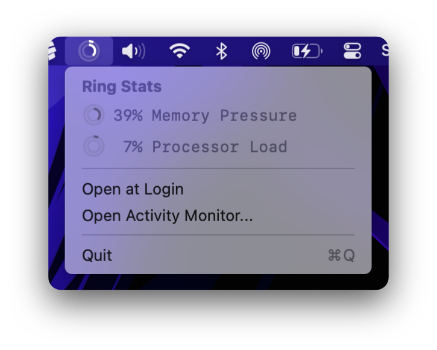

#  Ring Stats for macOS

Simple system statistics for your menu bar.
Values match those in Activity Monitor.

## Statistics

 - Inner ring shows memory pressure
 - Outer ring shows processor load

## Download

[Download the latest release](https://github.com/flostellbrink/RingStats/releases/latest)

 